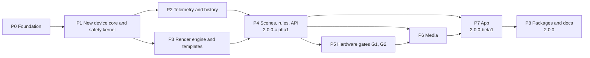

# Roadmap

Adopted 2026-09-25. It turns the 2.0 design concept (working title
kraken-lcd 2.0; the new name is chosen in P0) into ordered work: from a
tile carousel to an LCD studio for NZXT Kraken coolers with free layouts,
many values per screen, history and statistics, rules, media, and a
desktop app. Everything is written anew, the device core included; the
record of the device layer that has kept the development Kraken stable
since 1.3.3 is the bar the new core has to clear.

State at adoption: 1.3.3 had run for 8.3 days on the development
2024 Elite RGB (firmware 1.2.12) with 17,602 uploads, 0 bucket refusals,
0 failed uploads and no bootloader wedge. The new backgrounds for 1.4.0
are live on that host.

## Decisions

| | Topic | Decision |
|---|---|---|
| D1 | Architecture | Everything new, the device core included: its own protocol layer instead of a patched liquidctl, held to the recorded behaviour of 1.4.0 |
| D2 | Display paths | Staged: GIF scenes now; static frames and the direct stream only after a soak test on the development Kraken |
| D3 | User interface | Web UI (TypeScript) served by the local daemon, shown in its own app window |
| D4 | First stage | Backend core first: API, render engine with widgets, telemetry with history |
| D5 | Video | Local files and YouTube links as GIF loops first; playback over the direct stream once it is proven |
| D6 | Installation | Distribution packages (.deb, .rpm, AUR), install.sh as fallback |
| D7 | Name and language | A new name, chosen in P0 (without NZXT marks such as "Kraken"); UI in German and English |
| D8 | Cooling | Firmware curves by liquid temperature, plus switchable profiles |

## Principles

- **A new device core, held to the old one's record.** The core that
  talks to the Kraken is written anew as its own protocol layer on hidraw
  and USB bulk, without patching liquidctl's private internals. Before
  any of it exists, the behaviour of 1.4.0 is recorded: command sequences
  against the simulated Kraken and a passive usbmon capture on the
  development host. The new core reproduces them or documents each
  deliberate difference. Its first contact with the real device is
  supervised and starts read-only.
- **One device verified, the others by reference.** The 2024 Elite RGB is
  tested on hardware. The Kraken Z, 2023, 2023 Elite and 2024 Plus are
  implemented from liquidctl's driver and protocol notes and stay marked
  experimental until a device report confirms them.
- **One safety kernel.** Every path to the LCD goes through the upload
  governor, verify-before-stream, the health monitor, the cooldown ladder
  and bootloader detection. No feature bypasses it.
- **Hardware gates.** A new display path becomes a default only after a
  soak test on the development Kraken (G1, G2 below). Each hardware step
  starts with the owner's OK; a wedge needs a PSU power cut by the owner.
- **1.x keeps running** on the development host until 2.0 passes the
  parity soak (G0). The `1.x` branch gets fixes only.
- **Strict from the first commit:** Python >= 3.12, `mypy --strict`, an
  extended ruff rule set, at most 500 lines per file (tests included,
  enforced in CI), tests per layer.
- **The daemon stays offline.** No network access; downloads and media
  conversion run in the user's session.
- **One task at a time:** branch, pull request, CI green, verified on the
  real host where hardware is involved, then merge.

## Overview

Hardware soak time is serial on one device, software work is not: while
P5 occupies the Kraken, P6 and P7 proceed against the simulated Kraken.

| Milestone | Contents | Reached after |
|---|---|---|
| 1.4.0 | New default backgrounds | P0.1 |
| 2.0.0-alpha1 | Headless 2.0 replaces 1.x on the development host | P4 and gate G0 |
| 2.0.0-beta1 | App with all screens | P7 |
| 2.0.0 | Packages, documentation, release candidate soak | P8 |

Sizes: S = a few sessions, M = one to two weeks of sessions, L = more.
No calendar dates: soak tests set the pace of P4 and P5.

## P0 Foundation (S to M)

- **P0.1 Release 1.4.0.** Commit the new backgrounds, tag, push; the
  assets are already live in /opt. Create the `1.x` maintenance branch
  from the tag; `main` becomes 2.0 development.
- **P0.2 Name.** Five candidates, each checked against GitHub, PyPI and
  the Debian, Fedora and AUR package names, none using NZXT marks
  ("Kraken", "CAM"). The owner picks one. The rename lands with 2.0; 1.x
  keeps the name kraken-lcd.
- **P0.3 Architecture decision records** in `docs/adr/`:
  - 0001 strangler approach: 2.0 on `main`, 1.x on its branch, 1.x on the
    host until G0;
  - 0002 device core: own protocol layer; transport on hidraw or hidapi
    for HID, pyusb for bulk; liquidctl as reference, not as dependency;
  - 0003 API stack (lean: aiohttp on a Unix socket; criterion: packaged
    in Debian 13, Ubuntu 24.04 and 26.04, Fedora and Arch);
  - 0004 configuration v2: schema, versioning, migration from 1.x;
  - 0005 app shell: web UI in a WebKitGTK window bridged to the socket,
    browser fallback with a one-time token;
  - 0006 security model: users, groups, socket permissions, offline daemon;
  - 0007 display paths and the upload governor;
  - 0008 internationalisation (German, English).
- **P0.4 Tooling.** Python >= 3.12 in `pyproject.toml`, `mypy --strict`,
  extended ruff rules (adds bugbear-style, security and simplification
  checks), `scripts/check_line_limit.py` (500) in CI, coverage report,
  pre-commit hooks. The liquidctl matrix and the weekly canary move to
  the `1.x` branch, which still depends on liquidctl.
- **P0.5 Simulated Kraken.** A protocol-level fake: HID replies including
  the one-per-second status broadcast, the bucket table with configurable
  refusals, the bulk endpoint, a bootloader state.
- **P0.6 Reference recordings of 1.4.0.** Golden sequences of every
  device operation against the simulated Kraken (connect, status, liquid
  mode, brightness and orientation, bucket query, setup, delete and
  switch, GIF and static upload, memory clear, cooling curves, firmware
  info), plus a passive usbmon capture of the running 1.4.0 service on
  the development host. Nothing is sent to the device that 1.4.0 would
  not send anyway.

Exit: CI runs lint, types, line limit and tests against the simulated
Kraken; the reference recordings are in the repository; the name is
chosen; ADRs 0001 to 0008 accepted by the owner.

## P1 New device core and safety kernel (L)

- **P1.1 Transport:** HID reports on hidraw with the lessons of 1.3.3
  built in (drain stale reports before every command, read until the
  reply that matches the request), USB bulk with timeouts, discovery by
  USB id including the bootloader id 1e71:3011.
- **P1.2 Protocol for the 2024 Elite RGB:** status, liquid mode,
  brightness and orientation, bucket management that verifies every
  setup before streaming, GIF and static upload, memory clear. Every
  operation matches its reference recording from P0.6.
- **P1.3 Cooling commands** byte for byte equal to liquidctl's for the
  same curve, a pump duty floor, never sent together with frames. On
  hardware, the pump speed is read back after a curve is applied.
- **P1.4 The other models** from liquidctl's driver and protocol notes
  (bulk chunk size of the Kraken Z, RGB565 static frames on the 2023 with
  firmware 2.x, the 2024 Plus), tested against reference sequences and
  marked experimental.
- **P1.5 Safety kernel** as one component in front of the device:
  upload governor (uploads and bytes per hour, minimum interval,
  unchanged-payload skip), health monitor, cooldown ladder (5, 15, 60 min),
  bootloader guard. One entry point takes a scene GIF, a static frame or
  a stream frame; static and stream frames stay disabled until their gate
  passes.
- **P1.6 Typed health metrics** (uploads, refusals, failures, cooldowns,
  bootloader events) for the API.
- **P1.7 Supervised first contact** with the owner present, 1.x stopped
  for the duration: status read only, then liquid mode, brightness, one
  GIF upload, one memory clear, then 1.x back on.

Exit: every reference recording reproduced or its difference documented,
`mypy --strict` clean in `device/`, coverage >= 90 % there, the first
contact passed. liquidctl is no longer a runtime dependency.

## P2 Telemetry and history (M)

- **P2.1 Sensor providers** behind one interface: Kraken (liquid, pump,
  fan), CPU (load total and per core, temperature, clock, power where
  readable without root), GPU (NVIDIA through NVML or nvidia-smi, AMD
  through sysfs), memory, storage (temperatures, throughput), network,
  system (load average, uptime, time). A missing sensor is reported as
  missing, never guessed.
- **P2.2 Sampler** with a 1 s base rate, per-sensor intervals and an
  in-memory ring buffer.
- **P2.3 History** in SQLite with tiers (1 s for 1 h, 10 s for 24 h,
  1 min for 7 days, 10 min for 30 days), a size cap and retention;
  statistics (minimum, mean, maximum, time above a threshold); CSV export.

Exit: sampling at 1 Hz costs at most 1 % of one core on the development
host; the database stays under 50 MB at 30 days; tests use a fake clock
and a fake sysfs tree.

## P3 Render engine and templates (L)

Runs in parallel to P2.

- **P3.1 Layout model:** declarative and versioned, units relative to the
  round canvas, a safe zone, scaling to 640, 320 and 240 px.
- **P3.2 Widgets:** value, arc and ring, bar, per-core bars, chart
  (sparkline and area), clock, text, image. Theme tokens, colour by value,
  a readability scrim over moving backgrounds, a contrast check. Bundled
  OFL fonts (Barlow, Barlow Condensed, IBM Plex Mono) with their licences.
- **P3.3 Encoders:** scene GIF (the 1.x renderer; a GIF longer than
  `max_frames` is subsampled instead of cut, so its loop survives),
  static frame (the firmware's RGBA layout), stream frame (raw and Q565)
  behind gate G2.
- **P3.4 Templates:** the eleven concept screens (Cockpit, Orbit, Duo,
  History, Fire and Caustics with secondary values, Clock, Now Playing,
  Video, Alarm, Night) and the eight 1.x tiles re-expressed as templates.
- **P3.5 Golden-image tests** per template and size; a static 640 px
  frame renders in at most 100 ms on the development host.

Exit: every template renders from configuration, golden images are in
the repository, the render budget holds.

## P4 Scenes, rules, daemon, API: 2.0.0-alpha1 (L)

- **P4.1 Scene engine:** playlist with a duration per scene, the display
  path per scene, update intervals, governor integration, unchanged-frame
  skip.
- **P4.2 Rules:** triggers (time window, process running, sensor
  threshold with delay and hysteresis, session locked through logind),
  actions (scene, brightness, cooling profile), priority alarm over rules
  over playlist.
- **P4.3 Cooling profiles:** firmware curves by liquid temperature,
  switchable profiles, validation with a pump duty floor.
- **P4.4 Configuration v2** with automatic migration from 1.x (backup
  first, dry run available).
- **P4.5 API v1** on `/run/kraken-lcd/api.sock` for the `kraken-lcd`
  group: status, live sensors over WebSocket, history, layouts, playlist,
  rules, preview PNG, device health, brightness and orientation, cooling,
  media library upload. Versioned schemas and a typed client.
- **P4.6 CLI** on top of the API.
- **P4.7 Service hardening:** no network access (only Unix and netlink
  sockets), `ProtectSystem=strict` with explicit writable paths, no
  capabilities, a system call filter, the socket in `RuntimeDirectory`.
  USB and hidraw access verified afterwards.
- **P4.8 Gate G0, parity soak:** 2.0-alpha replaces 1.x on the
  development host with GIF scenes at the 1.x cadence for at least 10
  days, longer than the 8.3-day clean run that 1.3.3 had when this
  roadmap was adopted, because the device core is new. Rollback is
  reinstalling 1.4.0.

Exit: G0 passed, 2.0.0-alpha1 tagged.

## P5 Hardware gates for new display paths (M, plus soak time)

Starts after G0. Every step needs the owner's OK before it begins.

- **P5.1 Gate G1, static frames on the bucket path** with a fixed double
  buffer: two buckets at fixed offsets, as CoolerControl 5 does and as a
  user reported on identical hardware in liquidctl#774. Cadence steps
  20 s, 10 s, 5 s, 2 s; each at least 72 h, the 2 s step 7 days.
- **P5.2 Gate G2, direct stream prototype** as a standalone tool, not in
  the daemon, with the owner present: one raw frame (type 0x09), one
  Q565 frame (type 0x08), 1 fps for 1 h, 5 fps for 1 h, the highest
  stable rate, switching between a GIF scene and the stream, then 72 h at
  the chosen rate. The pump and fan curve commands (`72 01`, `72 02`) are
  never sent along with frames, whatever other projects do.
- **P5.3 Q565 encoder** (numpy) with round-trip tests against the
  reference format; encoding keeps up with 30 fps at 640 px.
- **P5.4 Results** in `docs/firmware-notes.md` and one ADR per gate:
  default, opt-in or rejected.

Exit: a documented decision for G1 and G2, and the default path for live
dashboards.

## P6 Media (M)

- **P6.1 User-session agent** (`systemd --user`): now playing via MPRIS,
  the media import worker, later audio via PipeWire; talks to the API.
- **P6.2 Import:** local video, GIF and images; YouTube links via yt-dlp
  (optional, detected at runtime; the user is responsible for the rights);
  ffmpeg for trimming, round cropping and scaling; conversion into
  device-safe loops with a size estimate and automatic reduction; a value
  bar over the video.
- **P6.3 Library in the daemon:** it accepts only files it re-encoded
  itself, with size caps and content sniffing.
- **P6.4 After G2:** video playback over the direct stream, an audio
  visualizer.

Exit: a YouTube clip becomes a round loop with a value bar on the LCD
within the upload budget; tests use fixture media.

## P7 App: 2.0.0-beta1 (L)

- **P7.1 Web UI** in TypeScript and Svelte, shipped as a static build,
  German and English from the start.
- **P7.2 App shell:** a WebKitGTK window bridged to the Unix socket, no
  TCP port. Fallback `kraken-lcd ui --browser`: localhost, one-time
  token, origin check.
- **P7.3 Screens in this order:** first-run wizard, overview, statistics
  and device, playlist and rules, designer, media, cooling, settings.
- **P7.4 End-to-end tests** (Playwright against the daemon with the
  simulated Kraken), keyboard and contrast checks, screenshots for the
  documentation.

Exit: 2.0.0-beta1 on the development host.

## P8 Packages, documentation, release 2.0.0 (M)

- **P8.1 Packages:** .deb (Debian 13, Ubuntu 24.04 and later), .rpm
  (Fedora, COPR), AUR; install.sh as fallback; uninstalling hands the LCD
  back to the firmware screen.
- **P8.2 The new name everywhere:** package, service, system user,
  paths. The upgrade from kraken-lcd 1.x imports its configuration and
  removes the old service and udev rule; the GitHub repository is renamed
  (old links redirect).
- **P8.3 Supply chain:** reproducible builds, signed release artifacts,
  an SBOM, pinned dependencies for the web UI build.
- **P8.4 Documentation** in German and English: user guide,
  troubleshooting, device matrix, architecture and ADRs, contributing.
- **P8.5 Release candidate:** at least 7 days of soak on the development
  host and the hardware smoke-test checklist.

Exit: 2.0.0 released.

## Gates

| Gate | What it proves | Pass criteria | Fallback |
|---|---|---|---|
| G0 | The new core is as safe as 1.x | 10 days of GIF scenes: 0 failed uploads, refusal rate not above 1.x, no wedge | Reinstall 1.4.0 |
| G1 | Static frames on the bucket path | Each cadence step: 0 failed uploads, refusals not above baseline, no wedge | Last passed cadence becomes the maximum |
| G2 | Direct stream | Every prototype step and 72 h at the chosen rate without failures or a wedge | Video stays as GIF loops, dashboards use G1 |

## After 2.0

In order of value:

1. Web pages and existing NZXT CAM Web Integrations (a `window.nzxt.v1`
   compatible host), once G2 has passed.
2. The RGB ring following the screen, once liquidctl supports the ring of
   the 2024 Elite (liquidctl#882).
3. Cooling by CPU or GPU temperature (D8 option B) as an opt-in, falling
   back to the firmware curve.
4. A shared template gallery.
5. The app as a Flatpak.
6. Upstream: follow up liquidctl#927, and offer the double buffer and the
   direct stream to liquidctl once they are proven here.

## Working agreement

- One task per pull request. Checklist: lint, `mypy --strict`, tests,
  line limit, and a run on the development host when hardware is
  involved.
- No reboot or power cycle without the owner. Each hardware gate step
  starts on the owner's OK.
- Commit messages describe the change and nothing else.
- Fixes for 1.x land on the `1.x` branch and are released from there.
